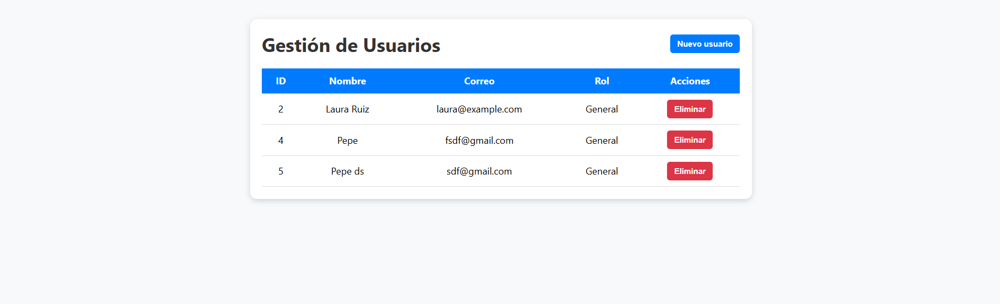
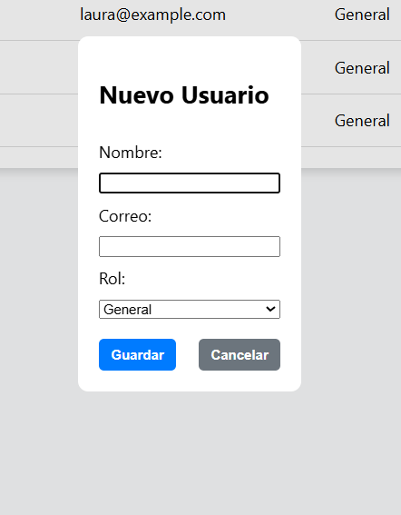

# Simple full stack app Frontend (Html, Css, JS) and Backend Php, PostgresSQl

## Frontend

### Read all users


### Insert new user



## Backend
### Database school_db (table -> usuarios)
In this part I have to create the database.

```postgresql
CREATE TABLE usuarios (
    id SERIAL PRIMARY KEY,
    nombre VARCHAR(100) NOT NULL,
    correo VARCHAR(150) UNIQUE NOT NULL,
    rol VARCHAR(20) CHECK (rol IN ('General', 'Admin')) NOT NULL DEFAULT 'General'
);
```

### Controller with php
Like I can not use a framework. I create the controller like this:
```php
<?php
require_once "src/php/service.php";

header("Content-Type: application/json");
header("Access-Control-Allow-Origin: *");
header("Access-Control-Allow-Methods: GET, POST, DELETE, OPTIONS");
header("Access-Control-Allow-Headers: Content-Type");

// Manejar preflight
if ($_SERVER['REQUEST_METHOD'] === 'OPTIONS') {
    http_response_code(204);
    exit;
}
//science
$method = $_SERVER['REQUEST_METHOD'];

switch ($method) {
    case 'GET':
        echo json_encode(obtenerUsuarios());
        break;

    case 'POST':
        $data = json_decode(file_get_contents("php://input"), true);
        if (isset($data['nombre'], $data['correo'], $data['rol'])) {
            insertarUsuario($data['nombre'], $data['correo'], $data['rol']);
            echo json_encode(["status" => "ok"]);
        } else {
            http_response_code(400);
            echo json_encode(["error" => "Datos incompletos"]);
        }
        break;

    case 'DELETE':
        $id = $_GET['id'] ?? null;
        if (!$id) {
            parse_str(file_get_contents("php://input"), $data);
            $id = $data['id'] ?? null;
        }

        if ($id) {
            eliminarUsuario((int)$id);
            echo json_encode(["status" => "ok"]);
        } else {
            http_response_code(400);
            echo json_encode(["error" => "ID faltante"]);
        }
        break;

    default:
        http_response_code(405);
        echo json_encode(["error" => "Método no permitido"]);
}
```
Can you see how I defined the method GET, POST, DELETE


```php

### Define the connection 
<?php

$host = "localhost";
$port = "9091";
$dbname = "shool_db";
$user = "jcvidal"; // cámbialo si tienes otro usuario
$password = "123456"; // cámbialo

try {
    // Conexión mediante PDO
    $conn = new PDO("pgsql:host=$host;port=$port;dbname=$dbname", $user, $password);

    // Activar modo de errores
    $conn->setAttribute(PDO::ATTR_ERRMODE, PDO::ERRMODE_EXCEPTION);

    // Forzar UTF-8
    $conn->exec("SET NAMES 'utf8'");

} catch (PDOException $e) {
    die("Error al conectar con PostgresSQL: " . $e->getMessage());
}


```
### Read user Get in Json
```json
[
  {
    "id": 2,
    "nombre": "Laura Ruiz",
    "correo": "laura@example.com",
    "rol": "General"
  },
  {
    "id": 4,
    "nombre": "Pepe",
    "correo": "fsdf@gmail.com",
    "rol": "General"
  },
  {
    "id": 5,
    "nombre": "Pepe ds",
    "correo": "sdf@gmail.com",
    "rol": "General"
  }
]
```

